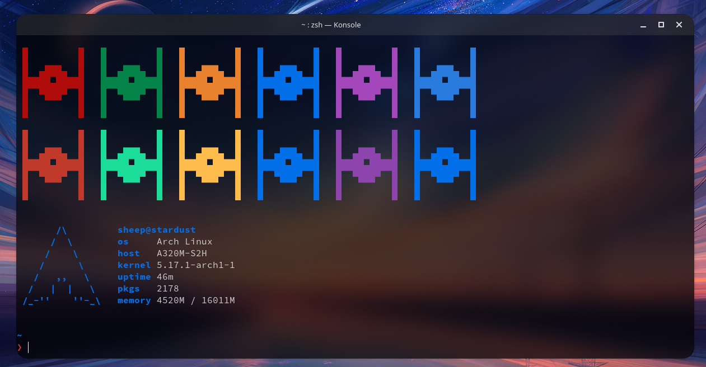

<p align="center">
    
    <h2 align="center">Lunar for Konsole</h2>
</p>

<p align="center">⌨️ A space-inspired theme for Konsole</p>

## 🖼️  Gallery



The stuff used in the preview is [pfetch](https://github.com/dylanaraps/pfetch) and [DT's colorscripts](https://gitlab.com/dwt1/shell-color-scripts)

## 💻 Installation

Automatic Installation

```shell
./install.sh
```

Manual Installation

1. 
```shell
git clone https://github.com/lunar-theme/konsole
```

2.
```shell
mv Lunar.colorscheme ~/.local/share/konsole
```

3. Go to Konsole settings and switch the profile colorscheme to Lunar

## 🤝 Contributing

Contributions, issues and feature requests are welcome!<br />Feel free to check [issues page](https://github.com/lunar-theme/spacetube/issues). 

## 🌟 Show your support

Give a ⭐️ if you like this project!

# 🚀 Contributors

Thanks goes to these wonderful people:

<!-- ALL-CONTRIBUTORS-LIST:START - Do not remove or modify this section -->

<!-- prettier-ignore-start -->

<!-- markdownlint-disable -->

<table>
  <tr>
    <td align="center"><a href="http://sheepdev.xyz"><br /><sub><b>sheep</b></sub></a><br /></td>
  </tr>
</table>


